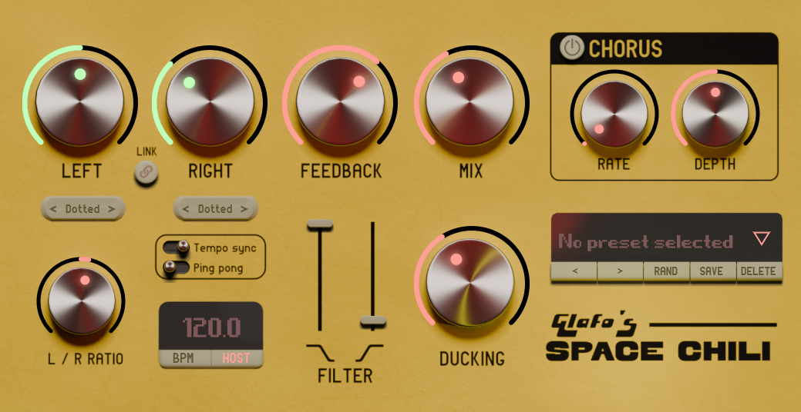

# Space Chili

Space Chili is a completely free and open-source delay and chorus plug-in, available in VST3, AU, and LV2 formats. Here are its key features:

- Two fully independent delay lines for left and right channels.
- Adjustable delay times ranging from 1 ms to 2.5 s.
- Synchronization options with either host tempo or internal BPM, supporting straight, triplet, and dotted note divisions.
- Stereo effect control with a ratio parameter to offset the two delay lines.
- Internal clock adjustable from 20 to 999 BPM.
- Simple chorus with adjustable modulation depth and rate.
- Built-in ducking effect.
- Two delay modes: normal and ping pong.
- Preset management system.
- Integrated low-pass and high-pass filters.

## Requirements

- macOS: macOS 10.11
- Windows: Windows 10

## Usage

### 1. **Delay Time: Left and Right Knobs**

These two knobs control the delay time for the left and right channels respectively. The time is measured in milliseconds unless you activate the **Tempo Sync** switch (see below), which allows you to set the time division instead.

- **Independent Control**: You can set each channel's delay time independently to create complex, multi-layered echoes. 
- **Link Button**: Located between the two knobs, the **Link** button allows you to sync the left and right channels.

### 2. **Tempo Sync and Note Mode**
- **Tempo Sync Switch**: Enables you to synchronize the delay time with the tempo, either based on the internal tempo or the host's tempo (DAW tempo).
  
- **Note Mode (Dotted, Triplet, Straight)**: Once **Tempo Sync** is active, the buttons below the delay time knobs allow you to switch between **Straight Notes**, **Triplets**, or **Dotted Notes** for rhythmic variations.

---

### 3. **Feedback Knob**
The **Feedback** knob adjusts the amount of delayed signal that is fed back into the input. This control determines how many times the echo will repeat before fading out.

- **0%**: No feedback; each delay will occur once.
- **100%**: Infinite repeats, creating a loop-like effect.

*Note*: Higher feedback values can create dense, ambient layers or even self-oscillating delays, adding to the spacey feel of your track.

---

### 4. **Mix Knob**
The **Mix** knob adjusts the balance between the dry (original) signal and the wet (delayed) signal.

- **0%**: No delay is applied; only the dry signal is heard.
- **100%**: Only the delayed signal is heard without the dry signal.

Use this to blend the delay effect into your mix, ranging from subtle enhancement to full-on delayed textures.

---

### 5. **L/R Ratio Knob**
The **Left/Right Ratio** knob controls the relationship between the left and right channel delays as a percentage of each other. It goes from -25% to +25%.

- **Negative Values**: The right channel delay becomes faster than the left.
- **Positive Values**: The right channel delay becomes slower than the left.

This control is key for achieving stereo width and imaging in your delay effect. Moving the knob in either direction will give you a stereo effect by slightly offsetting the timing between channels.

---

### 6. **Ping Pong Switch**
The **Ping Pong** effect sends the delayed signal bouncing back and forth between the left and right channels, creating a dynamic stereo movement.

- **Off**: The delay will remain in its respective channel.
- **On**: The delay will alternate between the left and right speakers for a wider stereo image.

---

### 7. **Tempo Sync BPM Section**
When **Tempo Sync** is enabled, you have the option to choose whether the plugin syncs to the internal BPM or to the **Host BPM** (your DAW’s tempo).

- **BPM Display**: This section displays the current tempo in beats per minute (BPM). If **Host** is selected, this value is locked to your DAW’s tempo. 
- **Internal BPM**: If using the internal clock, you can manually adjust the BPM by dragging the value up or down. The internal BPM range is from **60 BPM to 300 BPM**.

---

### 8. **Ducking Knob**
The **Ducking** control adjusts the intensity of the ducking effect, which lowers the volume of the delay when the original (dry) signal is present, and brings it back up when the dry signal fades out. This allows for cleaner mixes, as the delayed signal doesn't interfere with the primary sound.

- **0%**: No ducking, full delay effect at all times.
- **100%**: Maximum ducking, the delay will only be heard after the main signal quiets down.

---

### 9. **Chorus Section**
The **Chorus** effect adds modulation to the delayed signal.

- **Chorus On/Off Switch**: Toggles the chorus effect on or off.
- **Rate Knob**: Adjusts the speed of the modulation. The range is from **0.25 Hz to 5 Hz**.
- **Depth Knob**: Adjusts the intensity of the modulation, from 0% (no modulation) to 100% (maximum depth).

Use the chorus to add dimension and movement to your delay tails.

---

## Additional Features

### **Preset Selector**
- **Browse**: Use the **"<"** and **">"** buttons to navigate through saved presets. 
- **Save**: Click **Save** to store your current settings as a preset. On Windows, it saves to **C:\Users\Public\Documents**. On macOS, it saves to **/Users/Shared**.
- **Delete**: Click **Delete** to remove the selected preset.
- **Rand**: Press the **Rand** button to load a random preset.

---

## License

`space-chili` is .
